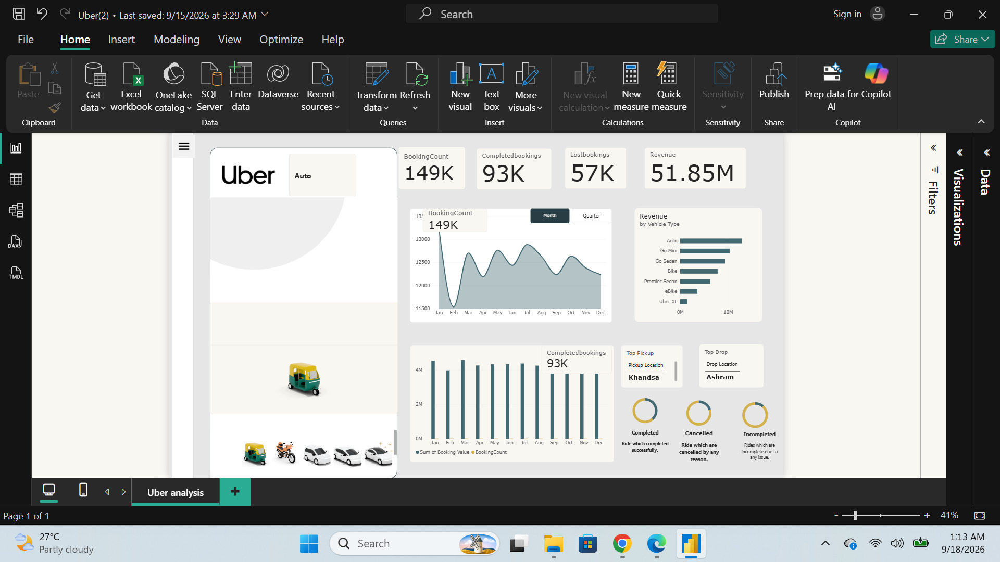

# Uber Ride Bookings Analysis

Power BI dashboard analyzing 150,000 Uber ride bookings across 7 vehicle types, tracking booking status, revenue, and cancellation patterns.

## Dashboard Overview

## Filtered by Vehicle Type

## Key Findings
- Only 62% of bookings (93,000) completed successfully; 38% failed due to driver cancellations (18%), customer cancellations (7%), no driver found (7%), or incomplete rides (6%)
- Analyzed $47.2M in completed booking revenue by vehicle type
- Auto was both the highest-volume (37K+ rides) and highest-earning segment ($11.7M)

## Tools Used
SQL, Power BI
